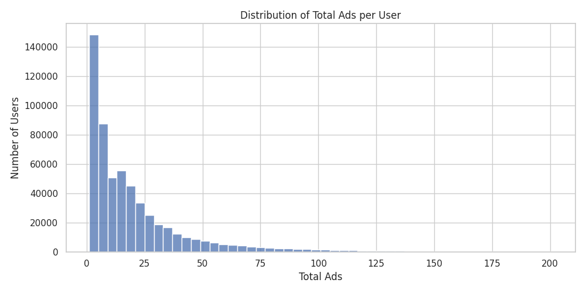
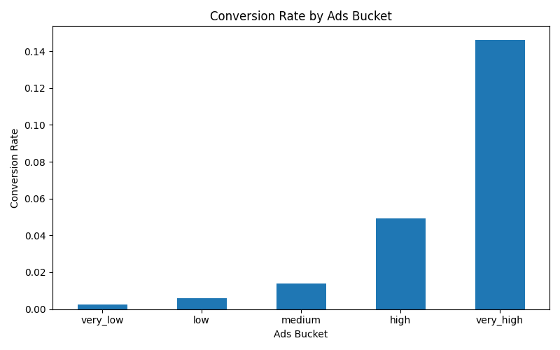
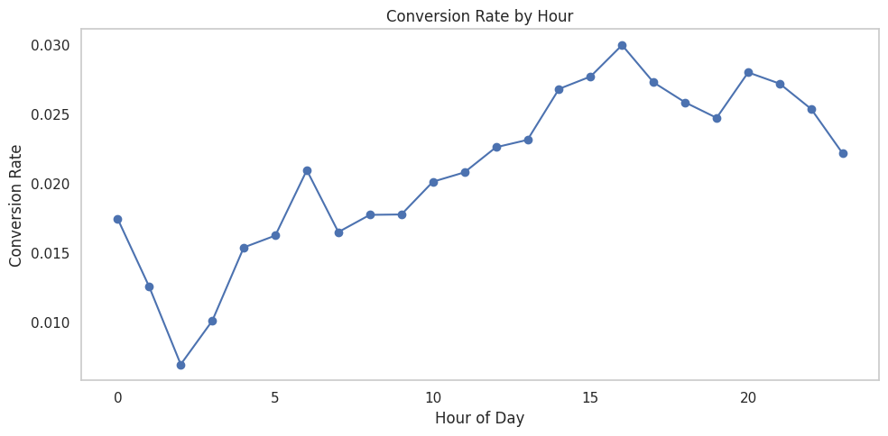
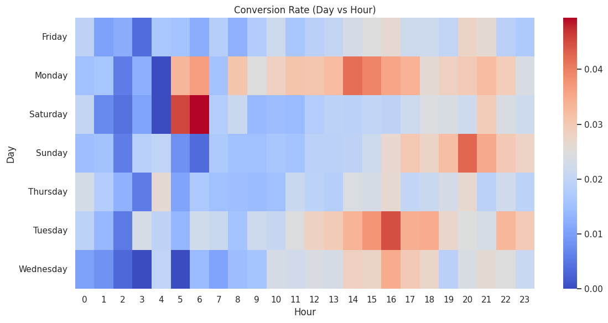

# 📊 Marketing Ads A/B Testing & Conversion Analysis

This project analyzes the impact of advertising exposure on user conversion using a real-world marketing dataset. It demonstrates a full data analysis workflow including **data cleaning, exploratory data analysis (EDA), segmentation, visualization, and A/B testing**.

---

## 🎯 Project Objective

* Analyze how advertising exposure affects user conversion
* Identify high-performing user segments
* Validate results using **statistical testing (A/B test)**
* Provide **data-driven business recommendations**

---

## 🗂 Dataset Overview

| Column          | Description                      |
| --------------- | -------------------------------- |
| `user_id`       | 🆔 Unique user identifier        |
| `total_ads`     | 📢 Number of ads seen by user    |
| `most_ads_day`  | 📅 Day with highest ad exposure  |
| `most_ads_hour` | 🕒 Hour with highest ad exposure |
| `converted`     | ✅ Conversion flag (0/1)          |
| `group`         | 🔄 Control vs Treatment group    |

---

## 🧹 1. Data Cleaning

### 🔍 Problem

* Dataset contains extreme outliers (up to 2000+ ads)
* These outliers can skew analysis results

### ✅ Solution

```python
import pandas as pd

# Remove top 1% outliers
threshold = df['total_ads'].quantile(0.99)
df = df[df['total_ads'] < threshold]

df['total_ads'].describe()
```

### 📊 Ads Distribution



👉 Most users fall within **1–30 ads**, with a long tail of heavy users.

---

## 🔍 2. Exploratory Data Analysis (EDA)

### 📌 Key Observations:

* Median ads: **13**
* Mean ads: **~21.8** → right-skewed distribution
* Majority users are low to medium exposure

---

## 🧩 3. User Segmentation (Ads Buckets)

### 🎯 Goal:

Group users based on ad exposure

```python
df['ads_bucket'] = pd.cut(
    df['total_ads'],
    bins=[0, 5, 15, 30, 60, 201],
    labels=['very_low', 'low', 'medium', 'high', 'very_high']
)
```

### 📊 Conversion by Bucket

```python
bucket_summary = df.groupby('ads_bucket')['converted'].agg(['mean','count'])
print(bucket_summary)
```

### 📈 Visualization

```python
bucket_summary['mean'].plot(kind='bar')
plt.title("Conversion Rate by Ads Bucket")
plt.ylabel("Conversion Rate")
plt.show()
```



### 💡 Insight:

* Conversion rate increases significantly with ad exposure
* High-frequency users convert much more

---

## 5.⏱ Time-based Analysis

### 🕒 Conversion by Hour



### 🔥 Conversion Heatmap (Day vs Hour)



### 💡 Insight:
- Conversion varies significantly by time
- Certain hours and days perform better
- Ad timing optimization can improve performance

---

## 🧪 6. A/B Testing

### 🎯 Objective:

Determine whether ads truly impact conversion (**causality**)

---

### 🧠 Hypothesis

* **H0:** No difference between control and treatment
* **H1:** Significant difference exists

---

### ⚙️ Implementation

```python
from scipy.stats import ttest_ind

control = df[df['group']=='control']['converted']
treatment = df[df['group']=='treatment']['converted']

t_stat, p_value = ttest_ind(control, treatment, equal_var=False)

print("T-stat:", t_stat)
print("P-value:", p_value)

# Compare means
print("Control mean:", control.mean())
print("Treatment mean:", treatment.mean())
```

---

### 📊 Result

* **P-value < 0.001**
* Reject H0 ✅

👉 Ads have a **statistically significant impact on conversion**

---

### 🚀 Conversion Uplift

```python
uplift = (treatment.mean() - control.mean()) / control.mean()
print(f"Conversion uplift: {uplift:.2%}")
```

---

## 💡 7. Business Insights

* 📈 Conversion increases with ad exposure
* 🎯 High-exposure users (60+ ads) have the highest conversion rate
* 🧪 A/B testing confirms ads significantly impact conversion

---

## 🧠 8. Recommendations

* 🎯 Target high-value users with optimized ad frequency
* ⏱ Focus on effective time slots (hour/day)
* ⚠️ Avoid excessive ads to prevent diminishing returns

---

## 📝 9. Key Takeaways

* Data cleaning prevents misleading insights
* Segmentation reveals hidden behavioral patterns
* A/B testing validates causal relationships
* Data-driven decisions improve marketing strategy

---

## 🛠 Tools & Technologies

* Python 🐍 (Pandas, NumPy)
* Visualization 📊 (Matplotlib, Seaborn)
* Statistics 📐 (SciPy – T-test)

---

## 🚀 Project Structure

```
marketing-ab-testing-analysis/
│
├── data/
├── notebooks/
├── images/
├── README.md
└── requirements.txt
```

---

## 👤 Author

**NAM** – Aspiring Data Analyst

📌 Focus: Data Analysis | A/B Testing | Business Insight
